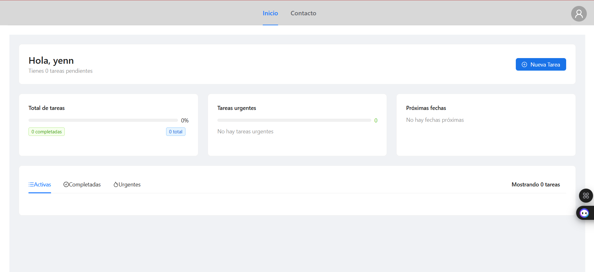
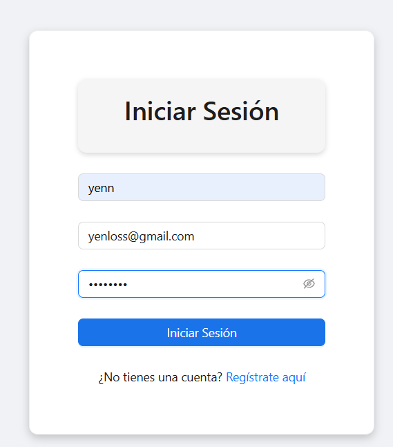
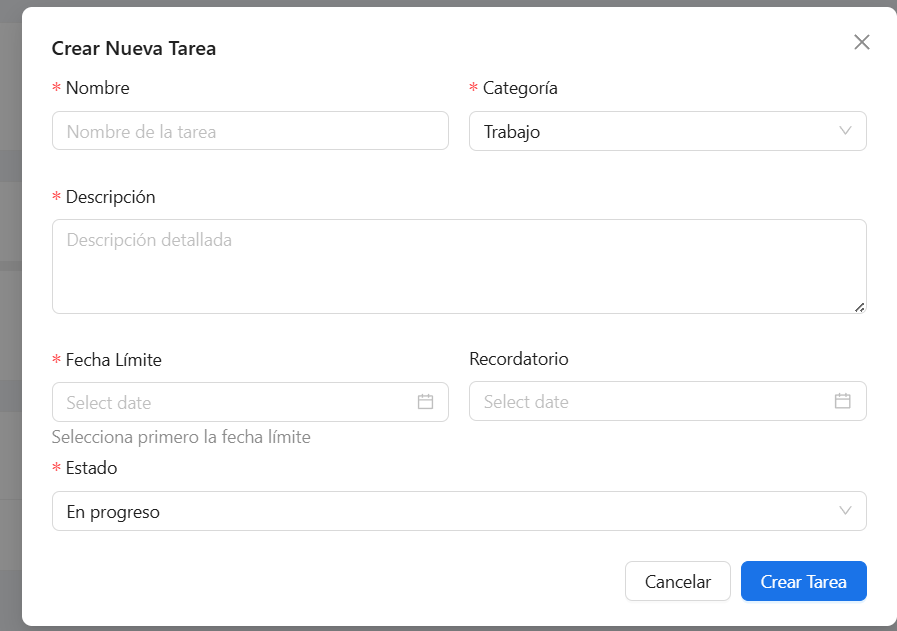
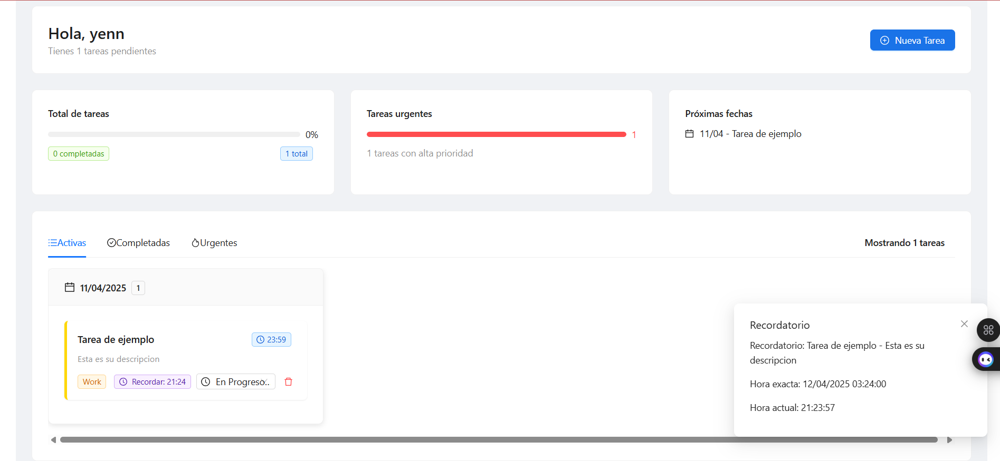
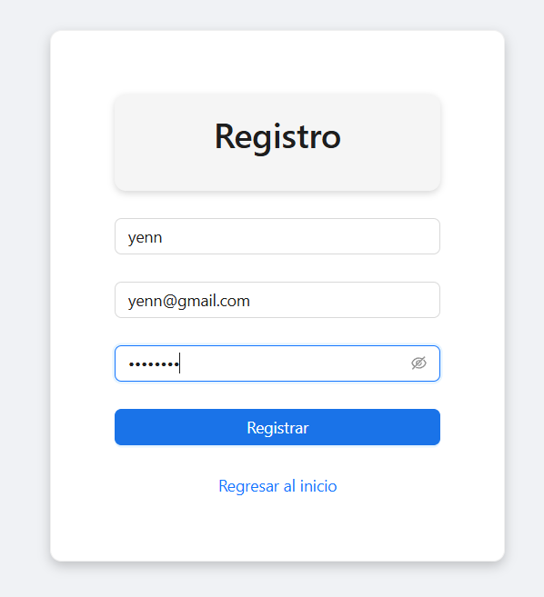
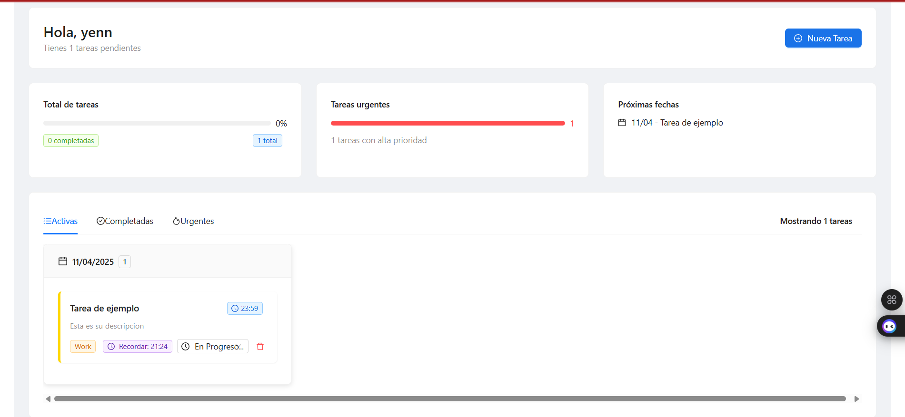
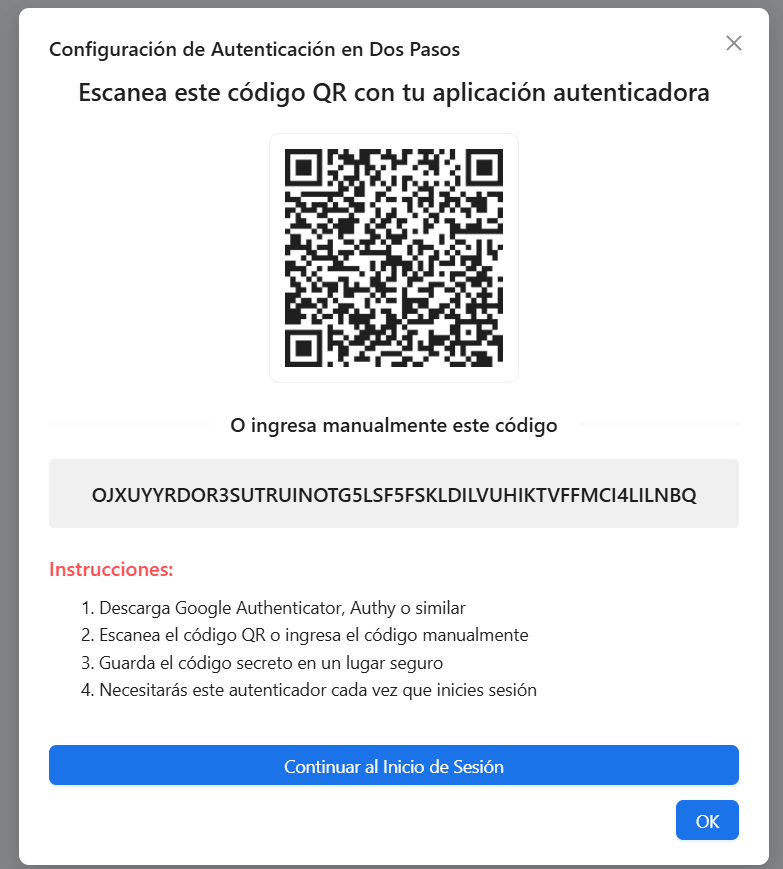

# RemindMe

## Introducción
RemindMe es una aplicación diseñada para mejorar la organización personal mediante recordatorios personalizables y notificaciones exactas al momento programado por el usuario. Está desarrollada para funcionar de manera independiente, ofreciendo mayor flexibilidad y seguridad en comparación con otras plataformas.

---

## Desarrollo Técnico

### Autenticación MFA
La autenticación multifactor (MFA) se utiliza para asegurar el acceso a la aplicación, proporcionando una capa adicional de seguridad.

### Base de Datos
La aplicación utiliza MongoDB para gestionar las tareas y usuarios, permitiendo escalabilidad y flexibilidad en el esquema de datos.

---

## Implementación

### Frontend
El frontend de RemindMe está estructurado en diferentes páginas y componentes esenciales para la experiencia del usuario, como la gestión de tareas y configuraciones de usuario, todo con un diseño comodo con Ant Design.

### Backend
El backend está organizado en microservicios para gestionar la autenticación y funcionalidades de las tareas de manera eficiente.

---

## Pruebas
La funcionalidad de RemindMe ha sido probada para asegurar su correcto funcionamiento y mejorar la organización personal de los usuarios.

---

## Despliegue
La infraestructura de RemindMe está configurada en Render para facilitar el despliegue y manejo de la aplicación en la nube.

---

## Manual de Usuario
Incluye instrucciones detalladas sobre cómo:
- Crear tareas
- Configurar preferencias
- Aprovechar las funcionalidades de seguridad

---

## Análisis Comparativo

### Ventajas sobre Alternativas
RemindMe ofrece:
- Recordatorios precisos
- Seguridad MFA integrada
- Personalización total
- Portabilidad sin depender de otras plataformas

### Limitaciones
Aunque ofrece ventajas significativas, RemindMe:
- No se integra con sistemas de gestión de aprendizaje (LMS)
- Utiliza recursos gratuitos provocando fallas de servidor
---

## 📸 Capturas de Pantalla 

---

## Roadmap Futuro
Se planea:
- Desarrollo de una aplicación móvil nativa
- Mejoras en rendimiento y experiencia de usuario

---

## Conclusiones
RemindMe es una solución robusta para mejorar la organización personal, destacando por su autonomía, notificaciones exactas y seguridad mejorada.

---

## Repositorios y Enlaces
- [Frontend en GitHub](https://github.com/EdDyRdz/RemaindMe-front.git)  
- [Backend en GitHub](https://github.com/EdDyRdz/RemaindMe-back.git)  
- [Aplicativo en Render](https://remaindme-front.onrender.com)  
